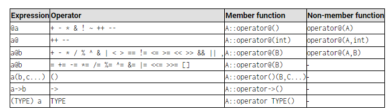

# OOP stands for Object-Oriented Programming

- Procedural programming is about writing procedures or
- functions that perform operations on the data,
- while object-oriented programming is about creating
- objects that contain both data and functions.
- OOP is faster and easier to execute
- OOP provides a clear structure for the programs
- OOP helps to keep the C++ code DRY "Don't Repeat Yourself", and makes the code easier to maintain, modify and debug
- OOP makes it possible to create full reusable applications with less code and shorter development time

## C++ What are Classes and Objects?

Classes and objects are the two main aspects of object-oriented programming.
Everything in C++ is associated with classes and objects, along with its attributes and methods.
` A class is a template for objects, and an object is an instance of a class`

```c++
class Fruit

Objects:
- Apple
- Banana
- Mango
```

```c++
class Car

objects:
- Volvo
- Audi
- Toyota
```

A `car` is an object. The car has `attributes`,
such as `weight` and `color`, and `methods`,
such as `drive` and `brake`.
`Attributes and methods are basically variables and functions that belongs to the class. These are often referred to as "class members"`.

``
#include <iostream>
#include <string>

-
-
- Implementation of dog that can bark:
- @param name
- @param age
- @param race

class Dog
{

public:
const char *name;
int age;
const char *race;
void Bark();
static void Info();
Dog(const char *newName, int newAge, const char *newRace);
};

// METHOD: Constructor
Dog::Dog(const char *newName, int newAge, const char *newRace)
{
name = newName;
age = newAge;
race = newRace;
}
// METHOD: Static method which provides
// information about the dog
void Dog::Info()
{
std::cout << "The dog is four legged animal" << std::endl;
}

# METHOD: A Dog that can bark:

void Dog::Bark()
{
if (age > 1)
std::cout << name << " Barks VOFF VOFF!\n";
else
std::cout << name << " is just a little puppy and dare not bark at you." << std::endl;
}
``
#include "dog.cpp"

- @brief Object-oriented programming (OOP) class Dog
- @author: Amer Andersson
- @conutry: Sweden
- @date: 2024
- @return 0

## Class Dog: A dog that can bark

class Dog;
``
Dog::Info();
Dog myDog;
myDog = new Dog("Fido", 3, "Golden Retriever");
myDog->age = 4;
myDog->Bark();

    std::cout << "Dog\'s name is " << myDog->name << ", is a "
              << myDog->race << " and is " << myDog->age << " years old.\n";

## Overloading operators
The operator overloads are just regular functions which can have any behavior; there is actually no requirement that the operation performed by that overload bears a relation to the mathematical or usual meaning of the operator, although it is strongly recommended. For example, a class that overloads operator+ to actually subtract or that overloads operator== to fill the object with zeros, is perfectly valid, although using such a class could be challenging.

The parameter expected for a member function overload for operations such as operator+ is naturally the operand to the right hand side of the operator. This is common to all binary operators (those with an operand to its left and one operand to its right). But operators can come in diverse forms. Here you have a table with a summary of the parameters needed for each of the different operators than can be overloaded (please, replace @ by the operator in each case):




Where a is an object of class A, b is an object of class B and c is an object of class C. TYPE is just any type (that operators overloads the conversion to type TYPE).

Notice that some operators may be overloaded in two forms: either as a member function or as a non-member function: The first case has been used in the example above for operator+. But some operators can also be overloaded as non-member functions; In this case, the operator function takes an object of the proper class as first argument.