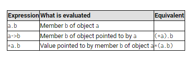

# Data structures

```c++
struct product {
  int weight;
  double price;
} apple, banana, melon;

apple.weight
apple.price
banana.weight
banana.price
melon.weight

struct product {
  int weight;
  double price;
} ;

product apple;
product banana, melon

```

This would access the value pointed by a hypothetical pointer member called title of the structure object pmovie (which is not the case, since title is not a pointer type). The following panel summarizes possible combinations of the operators for pointers and for structure members:

