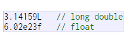

# The standard reserved keywords

alignas, alignof, and, and_eq, asm, auto, bitand, bitor, bool, break, case, catch, char, char16_t, char32_t, class, compl, const, constexpr, const_cast, continue, decltype, default, delete, do, double, dynamic_cast, else, enum, explicit, export, extern, false, float, for, friend, goto, if, inline, int, long, mutable, namespace, new, noexcept, not, not_eq, nullptr, operator, or, or_eq, private, protected, public, register, reinterpret_cast, return, short, signed, sizeof, static, static_assert, static_cast, struct, switch, template, this, thread_local, throw, true, try, typedef, typeid, typename, union, unsigned, using, virtual, void, volatile, wchar_t, while, xor, xor_eq

## Fundamental data types and they can mainly be classified into:

Character types: They can represent a single character, such as 'A' or '$'. The most basic type is char, which is a one-byte character. Other types are also provided for wider characters

Numerical integer types: They can store a whole number value, such as 7 or 1024. They exist in a variety of sizes, and can either be signed or unsigned, depending on whether they support negative values or not.

Floating-point types: They can represent real values, such as 3.14 or 0.01, with different levels of precision, depending on which of the three floating-point types is used.

Boolean type: The boolean type, known in C++ as bool, can only represent one of two states, true or false.

---

## Here is the complete list of fundamental types in C++:


## Type sizes above are expressed in bits; the more bits a type has, the more distinct values it can represent, but at the same time, also consumes more space in memory:


If the size or precision of the type is not a concern, then char, int, and double are typically selected to represent characters, integers, and floating-point values, respectively. The other types in their respective groups are only used in very particular cases

## compound data types

They are one of the main strengths of the C++ language. We will also see them in more detail in future chapters.

## Type deduction: auto and decltype

When a new variable is initialized, the compiler can figure out what the type of the variable is automatically by the initializer. For this, it suffices to use auto as the type specifier for the variable:

```c++
int foo = 0;
auto bar = foo;  // the same as: int bar = foo
int foo = 0;
decltype(foo) bar;  // the same as: int bar;

string literal

string mystring = "This is a string";
string mystring ("This is a string");
string mystring {"This is a string"};
```

---

## Integer Numerals


C++ allows the use of octal numbers (base 8) and hexadecimal numbers (base 16) as literal constants
All of these represent the same number: 75 (seventy-five) expressed as a base-10 numeral, octal numeral and hexadecimal numeral, respectively.

## suffixes


These literal constants have a type, just like variables. By default, integer literals are of type int. However, certain suffixes may be appended to an integer literal to specify a different integer type:

## For example:


Unsigned may be combined with any of the other two in any order to form unsigned long or unsigned long long.
In all the cases above, the suffix can be specified using either upper or lowercase letters

---

## Floating Point Numerals


They express real values, with decimals and/or exponents. They can include either a decimal point, an
`e` character (that expresses `by ten at the Xth height, where X` is an integer value that follows the e character), or both a decimal point and an e character:

These are four valid numbers with decimals expressed in C++. The first number is `PI`, the second one is the number of `Avogadro`, the third is the `electric charge of an electron` (an extremely small number) -all of them approximated-, and the last one is the number `three expressed as a floating-point numeric literal`.


---

The default type for floating-point literals is double. Floating-point literals of type float or long double can be specified by adding one of the following suffixes:

## For example:

 

Any of the letters that can be part of a floating-point numerical constant (e, f, l) can be written using either lower or uppercase letters with no difference in meaning.

---

## Character and string literals

Character and string literals are enclosed in quotes:

The first two expressions represent `single-character literals`, and the following two represent `string literals composed of several characters`. Notice that to represent a single character, we `enclose it between single quotes (')`, and to express a string (which generally consists of more than one character), we enclose the characters between `double quotes (")`

Character and string literals can also represent special characters that are difficult or impossible to express otherwise in the source code of a program, like newline (\n) or tab (\t). These special characters are all of them preceded by a backslash character (\).

## Here you have a list of the single character escape codes:


For example:

```c++
'\n'
'\t'
"Left \t Right"
"one\ntwo\nthree
```

## Ascii Codes


The standard ASCII table defines 128 character codes (from 0 to 127), of which, the first 32 are control codes (non-printable), and the remaining 96 character codes are representable characters:

- This panel is organized to be easily read in hexadecimal: row numbers represent the first digit and the column numbers represent the second one. For example, the "A" character is located at the 4th row and the 1st column, for that it would be represented in hexadecimal as 0x41 (65).

All the character literals and string literals described above are made of characters of type char. A different character type can be specified by using one of the following prefixes:

## Prefixes:


Note that, unlike type suffixes for integer literals, these prefixes are `case sensitive: lowercase for char16_t and uppercase for char32_t and wchar_t.`

## For string literals

For string literals, apart from the above` u, U, and L, two additional prefixes exist:`


In raw strings, backslashes and single and double quotes are all valid characters; the content of the literal is delimited by an initial R"sequence( and a final )sequence", where sequence is any sequence of characters (including an empty sequence). The content of the string is what lies inside the parenthesis, ignoring the delimiting sequence itself.

## For example:


Both strings above are equivalent to `"string with \\backslash". The R prefix can be combined with any other prefixes, such as u, L or u8.`

## Other literals

Three keyword literals exist in C++: true, false and nullptr:

- true and false are the two possible values for variables of type bool.
- nullptr is the null pointer value.
  

---

## Typed constant expressions

Sometimes, it is just convenient to give a name to a constant value:


## Preprocessor definitions (#define)

Another mechanism to name constant values is the use of preprocessor definitions. They have the following form:

#define identifier replacement

```c++
#include <iostream>
using namespace std;

#define PI 3.14159
#define NEWLINE '\n'

int main ()
{
  double r=5.0;               // radius
  double circle;

  circle = 2 * PI * r;
  cout << circle;
  cout << NEWLINE;

}
```

After this directive, any occurrence of identifier in the code is interpreted as replacement, where replacement is any sequence of characters (until the end of the line). This replacement is performed by the preprocessor, and happens before the program is compiled, thus causing a sort of blind replacement: the validity of the types or syntax involved is not checked in any way.

Note that the #define lines are preprocessor directives, and as such are single-line instructions that -unlike C++ statements- do not require semicolons (;) at the end; the directive extends automatically until the end of the line. If a semicolon is included in the line, it is part of the replacement sequence and is also included in all replaced occurrences.

---

## Bitwise operators ( &, |, ^, ~, <<, >> )

Bitwise operators modify variables considering the bit patterns that represent the values they store.


---

## Explicit type casting operator

Type casting operators allow to convert a value of a given type to another type. There are several ways to do this in C++. The simplest one, which has been inherited from the C language, is to precede the expression to be converted by the new type enclosed between parentheses (()):


The previous code converts the floating-point number 3.14 to an integer value (3); the remainder is lost. Here, the typecasting operator was (int). Another way to do the same thing in C++ is to use the functional notation preceding the expression to be converted by the type and enclosing the expression between parentheses


Both ways of casting types are valid in C++

---

## sizeof

This operator accepts one parameter, which can be either a type or a variable, and returns the size in bytes of that type or object:


Here, x is assigned the value 1, because char is a type with a size of one byte.

The value returned by sizeof is a compile-time constant, so it is always determined before program execution.

## Other operators

Later in these tutorials, we will see a few more operators, like the ones referring to pointers or the specifics for object-oriented programming.

## Precedence of operators

A single expression may have multiple operators. For example

n C++, the above expression always assigns 6 to variable x, because the % operator has a higher precedence than the + operator, and is always evaluated before. Parts of the expressions can be enclosed in parenthesis to override this precedence order, or to make explicitly clear the intended effect. Notice the difference:
difference


From greatest to smallest priority, C++ operators are evaluated in the following order


When an expression has two operators with the same precedence level, grouping determines which one is evaluated first: either left-to-right or right-to-left.

Enclosing all sub-statements in parentheses (even those unnecessary because of their precedence) improves code readability.

---

## Basic Input/Output

The example programs of the previous sections provided little interaction with the user, if any at all. They simply printed simple values on screen, but the standard library provides many additional ways to interact with the user via its `input/output features`. This section will present a short introduction to some of the most useful.

C++ uses a convenient abstraction called streams to perform input and output operations in sequential media such as the screen, the keyboard or a file. A stream is an entity where a program can either insert or extract characters to/from. There is no need to know details about the media associated to the stream or any of its internal specifications. All we need to know is that `streams are a source/destination of characters`, and that these characters are provided/accepted sequentially (i.e., one after another).

The standard library defines a handful of `stream objects` that can be used to access what are considered the standard sources and destinations of characters by the environment where the program runs:


We are going to see in more detail only cout and cin (the standard output and input streams); cerr and clog are also output streams, so they essentially work like cout, with the only difference being that they identify streams for specific purposes: error messages and logging; which, in many cases, in most environment setups, they actually do the exact same thing: they print on screen, although they can also be individually redirected.

## Standard output (cout)

On most program environments, the standard output by default is the screen, and the C++ stream object defined to access it is cout.

For formatted output operations, cout is used together with the insertion operator, which is written as << (i.e., two "less than" signs)


The << operator inserts the data that follows it into the stream that precedes it. In the examples above, it inserted the literal string Output sentence, the number 120, and the value of variable x into the standard output stream cout. Notice that the sentence in the first statement is enclosed in double quotes (") because it is a string literal, while in the last one, x is not. The double quoting is what makes the difference; when the text is enclosed between them, the text is printed literally; when they are not, the text is interpreted as the identifier of a variable, and its value is printed instead. For example, these two sentences have very different results


Multiple insertion operations (<<) may be chained in a single statement:


Assuming the age variable contains the value 24 and the zipcode variable contains 90064, the output of the previous statement would be:

The `endl` manipulator produces a newline character, exactly as the insertion of '\n' does; but it also has an additional behavior: the stream's buffer (if any) is flushed, which means that the output is requested to be physically written to the device, if it wasn't already. `This affects mainly fully buffered streams`, and cout is (generally) not a fully buffered stream. Still, it is generally a good idea to use endl only when flushing the stream would be a feature and '\n' when it would not. Bear in mind that a flushing operation incurs a certain overhead, and on some devices it may produce a delay.

## Standard input (cin)

In most program environments, the standard input by default is the keyboard, and the C++ stream object defined to access it is `cin`.

For formatted input operations, cin is used together with the extraction operator, which is written as `>>` (i.e., two "greater than" signs). This operator is then followed by the variable where the extracted data is stored. For example:


The first statement declares a variable of type int called age, and the second extracts from cin a value to be stored in it. This operation makes the program wait for input from cin; generally, this means that the program will wait for the user to enter some sequence with the keyboard. In this case, note that the characters introduced using the keyboard are only transmitted to the program when the ENTER (or RETURN) key is pressed. Once the statement with the extraction operation on cin is reached, the program will wait for as long as needed until some input is introduced.

As you can see, extracting from cin seems to make the task of getting input from the standard input pretty simple and straightforward. But this method also has a big drawback. What happens in the example above if the user enters something else that cannot be interpreted as an integer? Well, in this case, the extraction operation fails. And this, by default, lets the program continue without setting a value for variable i, producing undetermined results if the value of i is used later.

This is very poor program behavior. Most programs are expected to behave in an expected manner no matter what the user types, handling invalid values appropriately. Only very simple programs should rely on values extracted directly from cin without further checking. A little later we will see how `stringstreams` can be used to have better control over user input.
Extractions on cin can also be chained to request more than one datum in a single statement


In both cases, the user is expected to introduce two values, one for variable a, and another for variable b. Any kind of space is used to separate two consecutive input operations; this may either be a space, a tab, or a new-line character.

## cin and strings

The extraction operator can be used on cin to get strings of characters in the same way as with fundamental data types:

However, cin extraction always considers spaces (whitespaces, tabs, new-line...) as terminating the value being extracted, and thus extracting a string means to always extract a single word, not a phrase or an entire sentence.

To get an entire line from cin, there exists a function, called getline, that takes the stream (cin) as first argument, and the string variable as second. For example:

```c++

// cin with strings
#include <iostream>
#include <string>
using namespace std;

int main ()
{
  string mystr;
  cout << "What's your name? ";
  getline (cin, mystr);
  cout << "Hello " << mystr << ".\n";
  cout << "What is your favorite team? ";
  getline (cin, mystr);
  cout << "I like " << mystr << " too!\n";
  return 0;
}
```

Notice how in both calls to getline, we used the same string identifier (mystr). What the program does in the second call is simply replace the previous content with the new one that is introduced.

The standard behavior that most users expect from a console program is that each time the program queries the user for input, the user introduces the field, and then presses ENTER (or RETURN). That is to say, input is generally expected to happen in terms of lines on console programs, and this can be achieved by using getline to obtain input from the user. Therefore, unless you have a strong reason not to, you should always use getline to get input in your console programs instead of extracting from cin

## stringstream

he standard header `<sstream>` defines a type called `stringstream` that allows a string to be treated as a stream, and thus allowing extraction or insertion operations from/to strings in the same way as they are performed on cin and cout. This feature is most useful to convert strings to numerical values and vice versa. For example, in order to extract an integer from a string we can write


This declares a string with initialized to a value of "1204", and a variable of type int. Then, the third line uses this variable to extract from a stringstream constructed from the string. This piece of code stores the numerical value 1204 in the variable called myint

```c++
// stringstreams
#include <iostream>
#include <string>
#include <sstream>
using namespace std;

int main ()
{
  string mystr;
  float price=0;
  int quantity=0;

  cout << "Enter price: ";
  getline (cin,mystr);
  stringstream(mystr) >> price;
  cout << "Enter quantity: ";
  getline (cin,mystr);
  stringstream(mystr) >> quantity;
  cout << "Total price: " << price*quantity << endl;
  return 0;
}

```

In this example, we acquire numeric values from the standard input indirectly: Instead of extracting numeric values directly from cin, we get lines from it into a string object (mystr), and then we extract the values from this string into the variables price and quantity. Once these are numerical values, arithmetic operations can be performed on them, such as multiplying them to obtain a total price.

With this approach of getting entire lines and extracting their contents, we separate the process of getting user input from its interpretation as data, allowing the input process to be what the user expects, and at the same time gaining more control over the transformation of its content into useful data by the program.

## Selection statements: if and else

The if keyword is used to execute a statement or block, if, and only if, a condition is fulfilled. Its syntax is:
`if (condition) statement`

Here, `condition` is the expression that is being evaluated. If this` condition is true, statement` is executed. `If it is false, statement is not `executed (it is simply ignored), and the program continues right after the entire selection statement.
For example, the following code fragment prints the message `(x is 100)`, only if the value stored in the x variable is indeed 100:


If x is not exactly 100, this statement is ignored, and nothing is printed

If you want to include more than a single statement to be executed when the condition is fulfilled, these statements shall be enclosed in braces ({}), forming a block:


As usual, indentation and line breaks in the code have no effect, so the above code is equivalent to

```c++
if (x == 100) { cout << "x is "; cout << x; }
```

Selection statements with if can also specify what happens when the condition is not fulfilled, by using the else keyword to introduce an alternative statement. Its syntax is:

`if (condition) statement1 else statement2`
where statement1 is executed in case condition is true, and in case it is not, statement2 is executed.

For example:

```c++
if (x == 100)
  cout << "x is 100";
else
  cout << "x is not 100";
```

This prints x is 100, if indeed x has a value of 100, but if it does not, and only if it does not, it prints x is not 100 instead.
Several if + else structures can be concatenated with the intention of checking a range of values. For example.

```c++
if (x > 0)
  cout << "x is positive";
else if (x < 0)
  cout << "x is negative";
else
  cout << "x is 0";
```

This prints whether x is positive, negative, or zero by concatenating two if-else structures. Again, it would have also been possible to execute more than a single statement per case by grouping them into blocks enclosed in braces: {}.

## Iteration statements (loops)

Loops repeat a statement a certain number of times, or while a condition is fulfilled. They are introduced by the keywords `while, do, and for`

- The while loop
  The simplest kind of loop is the while-loop. Its syntax is:

`while (expression) statement`

The while-loop simply repeats statement while expression is true. If, after any execution of statement, expression is no longer true, the loop ends, and the program continues right after the loop. For example, let's have a look at a countdown using a while-loop:

```c++
 int n = 10;

  while (n>0) {
    cout << n << ", ";
    --n;
  }

  cout << "liftoff!\n";
```

The first statement in main sets n to a value of 10. This is the first number in the countdown. Then the while-loop begins: if this value fulfills the condition n>0 (that n is greater than zero), then the block that follows the condition is executed, and repeated for as long as the condition (n>0) remains being true.

1. n is assigned a value
2. The while condition is checked (n>0). At this point there are two possibilities:

- condition is true: the statement is executed (to step 3)
- condition is false: ignore statement and continue after it (to step 5)

3. Execute statement:
   `cout << n << ", ";
--n;`
   (prints the value of n and decreases n by 1)
4. End of block. Return automatically to step 2.
5. Continue the program right after the block:
   print liftoff! and end the program.

A thing to consider with while-loops is that the loop should end at some point, and thus the statement shall alter values checked in the condition in some way, so as to force it to become false at some point. Otherwise, the loop will continue looping forever. In this case, the loop includes --n, that decreases the value of the variable that is being evaluated in the condition (n) by one - this will eventually make the condition (n>0) false after a certain number of loop iterations. To be more specific, after 10 iterations, n becomes 0, making the condition no longer true, and ending the while-loop.

Note that the complexity of this loop is trivial for a computer, and so the whole countdown is performed instantly, without any practical delay between elements of the count (if interested, see `sleep_for` for a countdown example with delays).

```c++
// this_thread::sleep_for example
#include <iostream>       // std::cout, std::endl
#include <thread>         // std::this_thread::sleep_for
#include <chrono>         // std::chrono::seconds

int main()
{
  std::cout << "countdown:\n";
  for (int i=10; i>0; --i) {
    std::cout << i << std::endl;
    std::this_thread::sleep_for (std::chrono::seconds(1));
  }
  std::cout << "Lift off!\n";

  return 0;
}
```

## The do-while loop

A very similar loop is the do-while loop, whose syntax is:

`do statement while (condition)`;

It behaves like a while-loop, except that condition is evaluated after the execution of statement instead of before, guaranteeing at least one execution of statement, even if condition is never fulfilled. For example, the following example program echoes any text the user introduces until the user enters goodbye:

```c++
// echo machine
#include <iostream>
#include <string>
using namespace std;

int main ()
{
  string str;
  do {
    cout << "Enter text: ";
    getline (cin,str);
    cout << "You entered: " << str << '\n';
  } while (str != "goodbye");
}
```

The do-while loop is usually preferred over a while-loop when the statement needs to be executed at least once, such as when the condition that is checked to end of the loop is determined within the loop statement itself. In the previous example, the user input within the block is what will determine if the loop ends. And thus, even if the user wants to end the loop as soon as possible by entering goodbye, the block in the loop needs to be executed at least once to prompt for input, and the condition can, in fact, only be determined after it is executed.

## The for loop

The for loop is designed to iterate a number of times. Its syntax is:

`for (initialization; condition; increase) statement;`

Like the while-loop, this loop repeats statement while condition is true. But, in addition, the for loop provides specific locations to contain an initialization and an increase expression, executed before the loop begins the first time, and after each iteration, respectively. Therefore, it is especially useful to use counter variables as condition.

It works in the following way:

1. initialization is executed. Generally, this declares a counter variable, and sets it to some initial value. This is executed a single time, at the beginning of the loop.
2. condition is checked. If it is true, the loop continues; otherwise, the loop ends, and statement is skipped, going directly to step 5.
3. statement is executed. As usual, it can be either a single statement or a block enclosed in curly braces { }.
4. increase is executed, and the loop gets back to step 2.
5. the loop ends: execution continues by the next statement after it.

Here is the countdown example using a for loop

```c++
// countdown using a for loop
#include <iostream>
using namespace std;

int main ()
{
  for (int n=10; n>0; n--) {
    cout << n << ", ";
  }
  cout << "liftoff!\n";
}
```

The three fields in a for-loop are optional. They can be left empty, but in all cases the semicolon signs between them are required. For example, for (;n<10;) is a loop without initialization or increase (equivalent to a while-loop); and for (;n<10;++n) is a loop with increase, but no initialization (maybe because the variable was already initialized before the loop). A loop with no condition is equivalent to a loop with true as condition (i.e., an infinite loop).

Because each of the fields is executed in a particular time in the life cycle of a loop, it may be useful to execute more than a single expression as any of initialization, condition, or statement. Unfortunately, these are not statements, but rather, simple expressions, and thus cannot be replaced by a block. As expressions, they can, however, make use of the comma operator (,): This operator is an expression separator, and can separate multiple expressions where only one is generally expected. For example, using it, it would be possible for a for loop to handle two counter variables, initializing and increasing both:

```c++
for ( n=0, i=100 ; n!=i ; ++n, --i )
{
   // whatever here...
}
```

This loop will execute 50 times if neither n or i are modified within the loop:


`n` starts with a value of `0,` and `i `with `100,` the condition is `n!=i `(i.e., that n is not equal to `i`). Because `n` is increased by one, and i decreased by one on each iteration, the loop's condition will become false after the 50th iteration, when both n and i are equal to 50.

## Range-based for loop

The for-loop has another syntax, which is used exclusively with ranges:

This kind of for loop iterates over all the elements in` range`, where `declaration` declares some variable able to take the value of an element in this range. Ranges are sequences of elements, including arrays, containers, and any other type supporting the functions `begin` and `end`; Most of these types have not yet been introduced in this tutorial, but we are already acquainted with at least one kind of range: strings, which are sequences of characters.

An example of range-based for loop using strings:

```c++
// range-based for loop
#include <iostream>
#include <string>
using namespace std;

int main ()
{
  string str {"Hello!"};
  for (char c : str)
  {
    cout << "[" << c << "]";
  }
  cout << '\n';
}
```
Note how what precedes the ``colon (:)`` in the for loop is the declaration of a ``char`` variable (the elements in a string are of type ``char``). We then use this variable, ``c``, in the statement block to represent the value of each of the elements in the range.

This loop is automatic and does not require the explicit declaration of any counter variable.

Range based loops usually also make use of type deduction for the type of the elements with ``auto``. Typically, the range-based loop above can also be written as:

```c++
// range-based for loop
#include <iostream>
#include <string>
using namespace std;

int main ()
{
  string str {"Hello!"};
  for (auto c : str)
  {
    cout << "[" << c << "]";
  }
  cout << '\n';
}
```

---
* pacman -Syu
* pacman -Su
* pacman -Ss gcc
* pacman -S mingw-w64-i686-gcc 13.2.0-4
* pacman -Ss gdb
* g++ --version
* gcc --version
* gdb --version

```c++
Function	                                    Description
abs(x)	                                        Returns the absolute value of x
acos(x)	                                        Returns the arccosine of x
asin(x)	                                        Returns the arcsine of x
atan(x)	                                        Returns the arctangent of x
cbrt(x)	                                        Returns the cube root of x
ceil(x)	                                        Returns the value of x rounded up to its nearest integer
cos(x)	                                        Returns the cosine of x
cosh(x)	                                        Returns the hyperbolic cosine of x
exp(x)	                                        Returns the value of Ex
expm1(x)	                                    Returns ex -1
fabs(x)	                                        Returns the absolute value of a floating x
fdim(x, y)	                                    Returns the positive difference between x and y
floor(x)	                                    Returns the value of x rounded down to its nearest integer
hypot(x, y)	                                    Returns sqrt(x2 +y2) without intermediate overflow or underflow
fma(x, y, z)	                                Returns x*y+z without losing precision
fmax(x, y)	                                    Returns the highest value of a floating x and y
fmin(x, y)	                                    Returns the lowest value of a floating x and y
fmod(x, y)	                                    Returns the floating point remainder of x/y
pow(x, y)	                                    Returns the value of x to the power of y
sin(x)	                                        Returns the sine of x (x is in radians)
sinh(x)	                                        Returns the hyperbolic sine of a double value
tan(x)	                                        Returns the tangent of an angle
tanh(x)	                                        Returns the hyperbolic tangent of a double value
```

```binary
Hex: A,    B,    C,    D,    E,    F,    10,        11         12         13            14
Dec. 10,   11,   12,   13,   14,   15,   16,        17,        18         19            20
Oct: 12,   13,   14,   15,   16,   17,   20,        21,        22         23             24
Bin: 1010, 1011, 1100, 1101, 1110, 1111, 0001 0000, 0001 0001, 0001 0010, 0001 0011, 0001 0100,
```
```cmake
# appname := mycpp
# 
# CXX := g++
# CXXFLAGS := -Wall -g
# 
# srcfiles := $(shell find . -maxdepth 1 -name "*.cpp")
# objects  := $(patsubst %.cpp, %.o, $(srcfiles))
# 
# all: $(appname)
# 
# $(appname): $(objects)
#     $(CXX) $(CXXFLAGS) $(LDFLAGS) -o $(appname) $(objects) $(LDLIBS)
# 
# depend: .depend
# 
# .depend: $(srcfiles)
#     rm -f ./.depend
#     $(CXX) $(CXXFLAGS) -MM $^>>./.depend;
# 
# clean:
#     rm -f $(objects)
# 
# dist-clean: clean
#     rm -f *~ .depend
# 
# include .depend 
```


```binary
----------------------------------------
Decimal Numb | Binary Number |ex Number
----------------------------------------
0   	       |    0	         |     0
1	           |    1	         |     1
2	           |    10	       |     2
3	           |    11	       |     3
4	           |    100	       |     4
5	           |    101	       |     5
6	           |    110	       |     6
7	           |    111	       |     7
8	           |    1000	     |     8
9	           |    1001	     |     9
10	         |    1010	     |     A
11	         |    1011	     |     B
12	         |    1100	     |     C
13	         |    1101	     |     D
14	         |    1110	     |     E
15	         |    1111	     |     F
16	         |    10000	     |     10
17	         |    10001	     |     11
18	         |    10010	     |     12
19	         |    10011	     |     13
20	         |    10100	     |     14
21	         |    10101	     |     15
22	         |    10110	     |     16
23	         |    10111	     |     17
24	         |    11000	     |     18
25	         |    11001	     |     19
26	         |    11010	     |     1A
27	         |    11011	     |     1B
28	         |    11100	     |     1C
29	         |    11101	     |     1D
30	         |    11110	     |     1E
31	         |    11111	     |     1F
32	         |    100000	   |     20
64	         |    1000000    |     40
128	         |    10000000   |     80
256	              100000000  |     100
--------------------------------------
```
## "Unicode" is an encoding for mandarin, greek, arabic, etc. languages, typically 2-bytes per "character"
```C++   
32 space
33 !
34 "
35 #
36 $
37 %
38 &
39 '
40 (
41 )
42 *
43 +
44 ,
45 -
46 .
47 /
48 0
49 1
50 2
51 3
52 4
53 5
54 6
55 7
56 8
57 9
58 :
59 ;
60 <
61 =
62 >
63 ?
64 @
```
```C++
Character
65 A
66 B
67 C
68 D
69 E
70 F
71 G
72 H
73 I
74 J
75 K
76 L
77 M
78 N
79 O
80 P
81 Q
82 R
83 S
84 T
85 U
86 V
87 W
88 X
89 Y
90 Z
91 [
92 \
93 ]
94 ^
95 _
96 `
```
```C++
character
97 a
98 b
99 c
100 d
101 e
102 f
103 g
104 h
105 i
106 j
107 k
108 l
109 m
110 n
111 o
112 p
113 q
114 r
115 s
116 t
117 u
118 v
119 w
120 x
121 y
122 z
123 {
124 |
125 }
126 ~
```

## g++ -std=c++11 -Wall -Wextra -Wpedantic -Wshadow main.cpp -o main 
-std=c++20:
Sets compiler to the C++20 standard. Highly Recommended.
---
-Wall
-Wpedantic
-Wextra
-Wshadow
Enable compiler warnings. Highly recommended. These don't really activate all warnings, but rather the most important ones that don't produce too much (false positive) noise.
---
-o <filename>
Sets the name of the output (executable) file


std::vector<std::string> msg{"Hello", "C++", "World", "from", "VS Code", "and the C++ extension!"};

    for (const std::string &word : msg)
    {
        std::cout << word << " ";
    }
    std::cout << std::endl;

    g++ -std=c++23 -Wall -Wextra -Wpedantic -Wshadow main.cpp -o main

  blackjack: blackjack.cpp
	clang -o blackjack -cstd